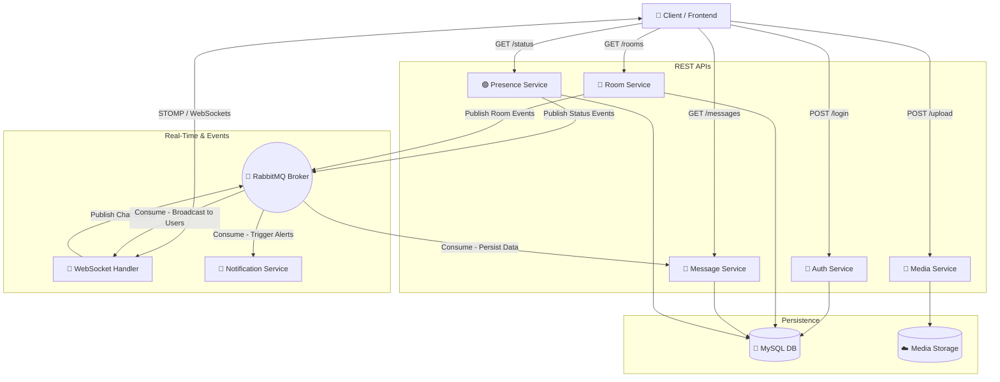
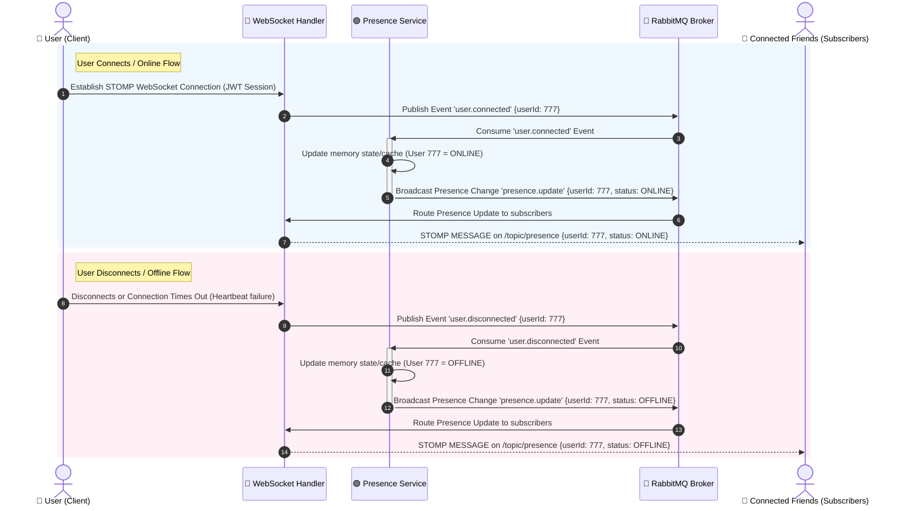
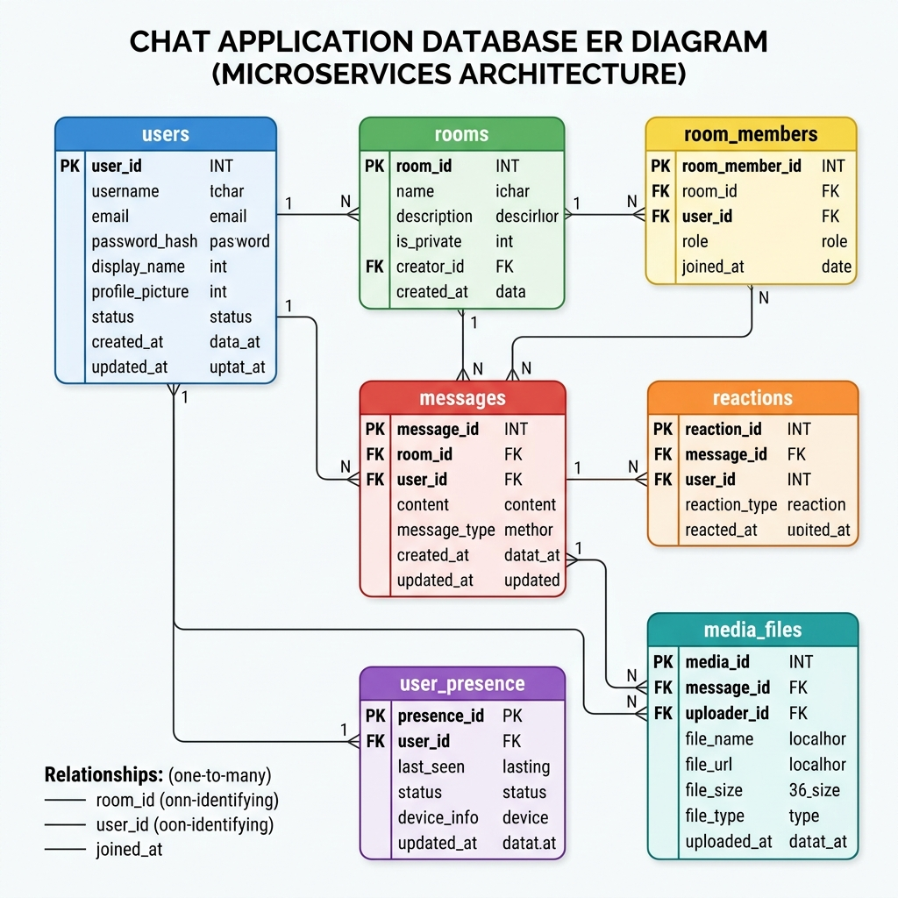
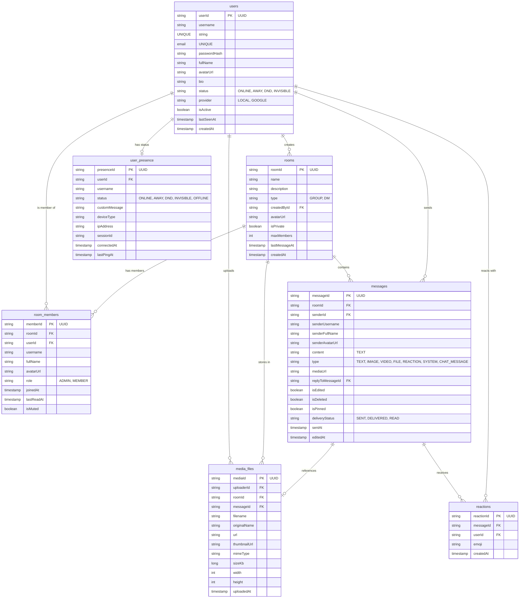
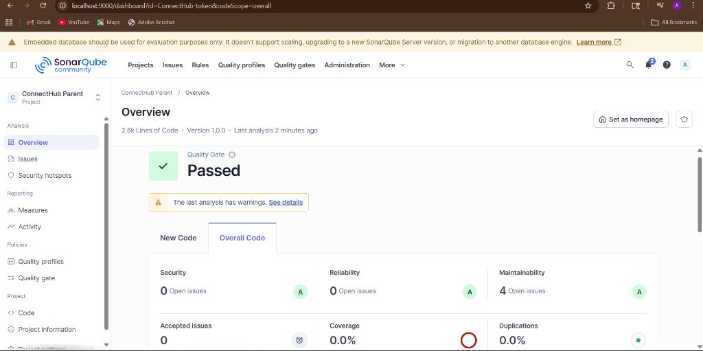

<div align="center">
  <h1>🌟 ConnectHub</h1>
  <p><em>A modern, scalable, real-time chat and communication platform powered by Microservices.</em></p>

  <!-- Badges -->
  
  
  
  
  
</div>

<br />

## 📖 Table of Contents
- [✨ Features](#-features)
- [🏗️ Architecture & Microservices](#️-architecture--microservices)
- [🎯 Service Use Cases](#-service-use-cases)
- [🔄 API & Communication Flow](#-api--communication-flow)
- [🗃️ Database ER Diagram](#-database-er-diagram)
- [💻 Tech Stack](#-tech-stack)
- [🚀 Getting Started](#-getting-started)
- [🧪 API Testing](#-api-testing)
- [📊 Code Quality & Analysis](#-code-quality--analysis)

---

## ✨ Features
- **Real-time Messaging**: Instant message delivery using WebSockets (STOMP).
- **Group Chats & Channels**: Create and manage custom chat rooms.
- **User Presence**: Live online/offline status tracking.
- **Media Support**: Upload and share files seamlessly.
- **Notifications**: Stay updated with real-time alerts.
- **Secure Authentication**: Robust JWT-based security and user management.

---

## 🏗️ Architecture & Microservices

ConnectHub uses a distributed microservices architecture to ensure high availability, scalability, and clean separation of concerns.

| Service | Description | Type |
| :--- | :--- | :--- |
| 🔐 **auth-service** | Handles user registration, login, JWT issuance, and security. | `REST` |
| 💬 **room-service** | Manages the creation, settings, and participants of chat groups. | `REST` |
| 📜 **message-service** | Stores, retrieves, and manages chat history and data. | `REST / Async` |
| 📁 **media-service** | Manages file and image uploads (local/S3 integration). | `REST` |
| 🟢 **presence-service** | Tracks and broadcasts real-time user online/offline status. | `REST / WebSocket` |
| 🔔 **notification-service**| Processes and delivers user notifications and alerts. | `Async` |
| 🔌 **websocket-handler** | Core real-time engine mapping STOMP messages to microservices. | `WebSocket` |

> **Note**: The frontend interacts with these services directly or via the WebSocket connection for real-time events.

---

## 🎯 Service Use Cases

Below are the key use cases, responsibilities, and operations handled by each of the microservices:

### 🔐 1. Auth Service (`auth-service`)
*   **User Registration & Validation**: Handles new user sign-ups with inputs validation (e.g., verifying if the email format is valid and if the username or email is already taken).
*   **Secure Authentication**: Log in existing users using secure password checking (passwords stored using high-security **BCrypt** hashing) or via Google OAuth providers.
*   **Session Token Dispatch**: Issue and validate state-free secure JSON Web Tokens (JWT) containing user identifiers and profile claims.
*   **Profile Queries**: Retrieve and manage user account details, including avatars, statuses, bios, and registration metadata.

### 💬 2. Room Service (`room-service`)
*   **Group Chat Rooms**: Creating channels and rooms with distinct descriptions, avatar pictures, and customizable capacities.
*   **Direct Messaging (DM)**: Initializing dedicated private 1-on-1 rooms between two users when they initiate a chat.
*   **Participant Membership**: Managing user associations, tracking who is joined in which room, adding new members, or allowing users to leave.
*   **Access Privileges**: Assigning roles (e.g., ADMIN vs. MEMBER) inside rooms to restrict actions like changing group settings or pinning messages.

### 📜 3. Message Service (`message-service`)
*   **Historical Chat Extraction**: Retrieve previous message logs with offset-based/page-based scrolling (paginated fetches) to keep client-side rendering fast and low on memory.
*   **Message Operations**: Enable users to edit or delete their sent messages (soft-delete tags to support auditing while updating the chat interface).
*   **Message Flagging (Pinning)**: Flag essential messages as pinned so that they can be easily retrieved by room participants.
*   **Persistence Worker**: Consume message streams asynchronously from RabbitMQ and persist them reliably to the MySQL database.

### 📁 4. Media Service (`media-service`)
*   **File Uploader Processing**: Accept files, documents, and media uploads through standard Multipart requests.
*   **Image Compression & Thumbnails**: Automatically scale, compress, and create thumbnails (using the **Thumbnailator** library) for image attachments to preserve network bandwidth.
*   **Persistent File Hosting**: Save media to local project directories or cloud object storage buckets (AWS S3) and register the unique generated URL.

### 🟢 5. Presence Service (`presence-service`)
*   **Real-time Online Monitoring**: Keep an active, lightning-fast in-memory/cache track of which users are currently online or offline.
*   **Heartbeat Timeout Detection**: Automatically flag idle or disconnected socket sessions as OFFLINE or AWAY after period pings fail.
*   **Status Broadcasting**: Dispatch instant presence status change events (ONLINE, AWAY, DND, OFFLINE) over RabbitMQ so that friends see their state change instantly.

### 🔌 6. WebSocket Handler (`websocket-handler`)
*   **Stateful Connection Engine**: Accept and manage stateful TCP and STOMP WebSocket client connections.
*   **Token Verification**: Verify the client's JWT session credential in headers upon handshake before establishing a connection.
*   **Active Route Mapping**: Map user actions (sending text, message pinning, typing status) to RabbitMQ topics and exchange nodes.
*   **Broadcast Subscriptions**: Target and instantly push message updates and presence events to active subscribers.

### 🔔 7. Notification Service (`notification-service`)
*   **Offline Notifications Logger**: Store unread event logs, mentions, or direct message alerts locally inside a database for later reading.
*   **Email Alert Fallback**: Check if a target user is offline, and if so, dispatch automated notification messages via Gmail SMTP.

---

## 🔄 API & Communication Flow

To understand the inter-service communication and client request pipelines, explore the detailed flowcharts and sequence diagrams for each microservice below.

### 🗺️ Overall System Architecture Map
This high-level map represents how the client communicates via **REST** and **WebSockets**, and how backend components coordinate asynchronously via **RabbitMQ**.



---

### 🔍 Service-by-Service Flow Diagrams

Please click on any microservice below to expand its precise API and internal execution flow diagram.

<details>
<summary><b>🔐 1. Auth Service (Registration, Login & Profile Retrieval)</b></summary>
<br/>

Handles password hashing, secure JWT issuance, and database validation of user credentials.

```mermaid
sequenceDiagram
    autonumber
    actor Client as 📱 Frontend Client
    participant Auth as 🔐 Auth Service
    database DB as 🐬 MySQL (Users DB)

    rect rgb(240, 248, 255)
        note right of Client: User Registration Flow
        Client->>Auth: POST /api/auth/register (username, email, password)
        Auth->>Auth: Validate Inputs & Hash Password (BCrypt)
        Auth->>DB: Check if email/username exists
        alt Already Exists
            Auth-->>Client: 400 Bad Request (Error: User already exists)
        else Available
            Auth->>DB: INSERT INTO users (username, email, password_hash)
            Auth-->>Client: 201 Created (User Object / Success Message)
        end
    end

    rect rgb(255, 240, 245)
        note right of Client: User Login & JWT Generation Flow
        Client->>Auth: POST /api/auth/login (email, password)
        Auth->>DB: SELECT * FROM users WHERE email = ?
        alt User Not Found / Invalid Credentials
            Auth-->>Client: 401 Unauthorized (Invalid credentials)
        else Credentials Valid
            Auth->>Auth: Generate JWT Token (Claims: userId, email, roles)
            Auth-->>Client: 200 OK (JWT Token, User Profile info)
        end
    end

    rect rgb(245, 255, 250)
        note right of Client: Profile Query Flow
        Client->>Auth: GET /api/auth/profileOfUser?email=... (Authorization: Bearer <JWT>)
        Auth->>Auth: Validate JWT Token Signature & Expiry
        Auth->>DB: SELECT username, email, profile_pic FROM users WHERE email = ?
        Auth-->>Client: 200 OK (User Profile Data)
    end
```
</details>

<details>
<summary><b>💬 2. Room Service (Room & Channel Management)</b></summary>
<br/>

Manages public and private group chat rooms, participant association, and owner authorization.

```mermaid
sequenceDiagram
    autonumber
    actor Client as 📱 Frontend Client
    participant Room as 💬 Room Service
    database DB as 🐬 MySQL (Rooms DB)

    rect rgb(240, 248, 255)
        note right of Client: Room Creation Flow
        Client->>Room: POST /api/rooms/create {name, description, members} (Auth Header)
        Room->>Room: Validate JWT & Extract User ID (Owner)
        Room->>DB: INSERT INTO rooms (name, description, owner_id)
        Room->>DB: INSERT INTO room_members (room_id, user_id) FOR each member
        Room-->>Client: 201 Created (Room Details with ID)
    end

    rect rgb(255, 240, 245)
        note right of Client: Fetching User Rooms
        Client->>Room: GET /api/rooms/my-rooms (Auth Header)
        Room->>Room: Extract User ID from JWT
        Room->>DB: SELECT r.* FROM rooms r JOIN room_members rm ON r.id = rm.room_id WHERE rm.user_id = ?
        Room-->>Client: 200 OK (List of Rooms & member details)
    end
```
</details>

<details>
<summary><b>🔌 3. WebSocket Handler & 📜 Message Service (Real-Time Chat & Persistence)</b></summary>
<br/>

Illustrates how messages are transmitted instantly across WebSockets, queued in RabbitMQ, broadcast to clients, and persisted asynchronously in the database.

```mermaid
sequenceDiagram
    autonumber
    actor UserA as 📱 User A (Sender)
    participant WS as 🔌 WebSocket Handler
    participant RMQ as 🐇 RabbitMQ Broker
    participant MsgSvc as 📜 Message Service
    database DB as 🐬 MySQL (Messages DB)
    actor UserB as 📱 User B (Recipient)

    rect rgb(240, 248, 255)
        note right of UserA: Real-time STOMP Connection & Publish
        UserA->>WS: Establish Connection (ws://.../ws) with JWT
        WS->>WS: Validate JWT Token
        WS-->>UserA: Connection Established (ACK)
        
        UserB->>WS: Subscribe to /topic/room.123 (Room Chat Topic)
        UserA->>WS: Send message to /app/chat.send {roomId: 123, content: "Hello!"}
    end

    rect rgb(255, 240, 245)
        note right of WS: Event Dissemination & Persistence
        WS->>RMQ: Publish message to Exchange 'chat.exchange' (Routing key: room.123)
        
        par Real-time Broadcast
            RMQ->>WS: Route message to subscribers of room.123
            WS-->>UserB: STOMP MESSAGE on /topic/room.123 {id, sender, content, timestamp}
            WS-->>UserA: STOMP MESSAGE on /topic/room.123 (Self Broadcast/Ack)
        and Database Persistence
            RMQ->>MsgSvc: Route copy to 'chat.queue.save'
            activate MsgSvc
            MsgSvc->>DB: INSERT INTO messages (room_id, sender_id, content, timestamp)
            MsgSvc-->>RMQ: Acknowledge Message Delivery (ACK)
            deactivate MsgSvc
        end
    end

    rect rgb(245, 255, 250)
        note right of UserA: Loading Historical Chats
        UserA->>MsgSvc: GET /api/messages/history/123?page=0&size=50 (Auth Header)
        MsgSvc->>DB: SELECT * FROM messages WHERE room_id = 123 ORDER BY timestamp DESC
        MsgSvc-->>UserA: 200 OK (JSON List of Paginated Messages)
    end
```
</details>

<details>
<summary><b>📁 4. Media Service (Image & File Handling)</b></summary>
<br/>

Performs input validation, media compression, thumbnail generation, storage uploading, and updates files database metadata.

```mermaid
sequenceDiagram
    autonumber
    actor Client as 📱 Frontend Client
    participant Media as 📁 Media Service
    participant Storage as ☁️ Local Uploads / S3
    database DB as 🐬 MySQL (Media Metadata DB)

    Client->>Media: POST /api/media/upload (Multipart File + Type)
    activate Media
    Media->>Media: Validate File Extension & Size
    alt If Image
        Media->>Media: Compress & Create Image Thumbnail (via Thumbnailator)
    end
    Media->>Storage: Save Original File & Thumbnail
    Storage-->>Media: Return File Path/URL & Thumbnail Path/URL
    Media->>DB: INSERT INTO media_files (file_name, file_url, thumbnail_url, file_size, uploader_id)
    Media-->>Client: 201 Created (JSON metadata including file_url and thumbnail_url)
    deactivate Media
```
</details>

<details>
<summary><b>🟢 5. Presence Service (Online Status & Heartbeat Tracking)</b></summary>
<br/>

Listens to server session connects/disconnects, updates user status in memory/cache, and triggers real-time presence events to friends.


</details>

<details>
<summary><b>🔔 6. Notification Service (Offline Messaging Alerts)</b></summary>
<br/>

Monitors queues for unread activities or key triggers, checks if the target recipient is online, and dispatches fallback emails via SMTP when offline.

```mermaid
sequenceDiagram
    autonumber
    participant RMQ as 🐇 RabbitMQ Broker
    participant Notif as 🔔 Notification Service
    database DB as 🐬 MySQL (Notifications DB)
    participant Gmail as 📧 Gmail SMTP Server
    actor User as 📱 Offline User

    note over RMQ, Notif: An event (e.g., missed message, new mention) triggers an alert
    RMQ->>Notif: Consume 'notification.alert' Event {recipientId: 888, senderName: "Alice", content: "Hey!"}
    activate Notif
    Notif->>DB: INSERT INTO notifications (recipient_id, message, is_read) VALUES (888, "Alice: Hey!", false)
    
    Notif->>Notif: Check if user has active session in Presence Service
    alt User is Online
        Notif-->>RMQ: Do nothing (WebSocket Handler will broadcast direct chat)
    else User is Offline
        Notif->>Gmail: Dispatch Email Notification (via SMTP)
        Gmail-->>User: Deliver email "You have a new message from Alice"
    end
    Notif-->>RMQ: Acknowledge Event (ACK)
    deactivate Notif
```
</details>

---

## 🗃️ Database ER Diagram

Since ConnectHub follows a **Database-per-Service** pattern, each microservice manages its own isolated schemas in MySQL (or S3 for file contents). Below is the visual logical Entity-Relationship (ER) diagram mapping fields, datatypes, and relationships across the entire platform.

<div align="center">
  
</div>

<br/>

<details>
<summary><b>🛠️ Show Interactive Mermaid ER Diagram Source Code</b></summary>
<br/>


</details>

---

## 💻 Tech Stack

### Backend
- **Core Framework**: Java 17, Spring Boot 3.2.0
- **Data Persistence**: Spring Data JPA, Hibernate, MySQL
- **Message Broker**: RabbitMQ (Async inter-service communication)
- **Real-time Comm**: WebSockets, STOMP protocol
- **Security**: JSON Web Tokens (JWT)

### Frontend
- **Framework**: React 19, Vite
- **Routing**: React Router DOM
- **Real-time Client**: `@stomp/stompjs`, `sockjs-client`
- **Styling**: Modern CSS / UI Components

---

## 🚀 Getting Started

Follow these instructions to get a copy of the project up and running on your local machine.

### 📋 Prerequisites
Ensure you have the following installed:
- [Java 17 JDK](https://adoptium.net/)
- [Node.js (v18+)](https://nodejs.org/)
- [MySQL Server](https://dev.mysql.com/downloads/)
- [RabbitMQ](https://www.rabbitmq.com/download.html)

### ⚙️ Setup & Configuration

1. **Database Preparation**: 
   Ensure MySQL is running. Create necessary databases for the microservices if `spring.jpa.hibernate.ddl-auto` is not set to `update` or `create`.
2. **Environment Variables**: 
   Update connection strings (Database URL, RabbitMQ credentials, JWT Secrets) in the `application.yml` of each respective microservice.

### 🏃‍♂️ Running the Application

#### 1. Start the Backend Microservices
You can launch all services at once or individually.

<details>
<summary><b>Option A: One-Click Start (Windows PowerShell)</b></summary>
<br/>
Run the provided PowerShell script in the root directory to boot all services sequentially:

```powershell
.\run_all.ps1
```
</details>

<details>
<summary><b>Option B: Manual Start</b></summary>
<br/>
Navigate into each service directory and use the Maven wrapper:

```bash
cd auth-service
../mvnw spring-boot:run
```
*(Repeat for `websocket-handler`, `room-service`, etc. It is recommended to start the broker and auth service first).*
</details>

<br/>

#### 2. Start the Frontend Application
Open a new terminal session, navigate to the frontend folder, and start the development server:

```bash
cd connecthub-frontend
npm install
npm run dev
```
> The application will be live at: [http://localhost:5173](http://localhost:5173)

---

## 🧪 API Testing
A comprehensive **Postman Collection** is included to help you test the REST APIs easily.

- **File Location**: `ConnectHub_Postman_Collection.json` (in the root directory)
- **Usage**: Import the file directly into your Postman workspace to explore endpoints for authentication, rooms, media, and messaging.

---

## 📊 Code Quality & Analysis

We maintain a high standard of code hygiene, security, and maintainability across the ConnectHub microservices. The project is regularly audited using **SonarQube** to ensure compliance with enterprise-grade quality gates.

### 🏆 SonarQube Metrics Summary
*   **Quality Gate Status**: 🟢 **PASSED**
*   **Total Lines of Code**: 2.6k Lines
*   **Security Rating**: 🅰️ (0 Open Issues)
*   **Reliability Rating**: 🅰️ (0 Open Issues)
*   **Maintainability Rating**: 🅰️ (4 Open Issues)
*   **Duplications**: 🟢 **0.0%**

<div align="center">
  
</div>

---
<div align="center">
  <p>Built with ❤️ for seamless real-time communication.</p>
</div>
